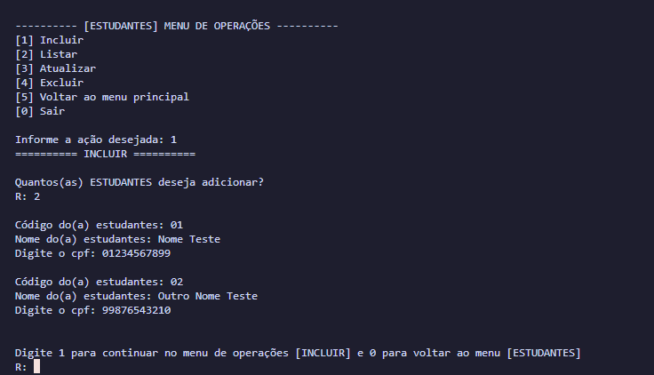

# CRUD - school management

> status: finished ✔️

_Read this in other languages:_
[_português_](./translations/README-ptBR.md)

## About the Project

This is a CRUD project for school management, which includes all CRUD functionalities and stores all data in JSON format. Within the program, it is possible to create, delete, update, and read data for students, teachers, admission, classes, and discipline.

## Example Photo





## Technologies Used and Dependencies

<table>
  <tr>
    <td>Python</td>
  </tr>
  <tr>
    <td>^3.x</td>
  </tr>
</table>

## How to Use

- Clone this repository to your local environment:

```bash
git clone https://github.com/eriksgda/crud.git
```

- Run the main program file::

```bash
python main.py
```

- Follow the instructions on the command line to navigate the system and perform CRUD operations within the system.

## License

This project is under [MIT](./LICENSE) license.
