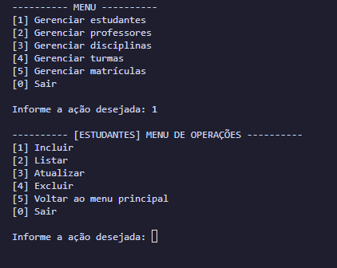
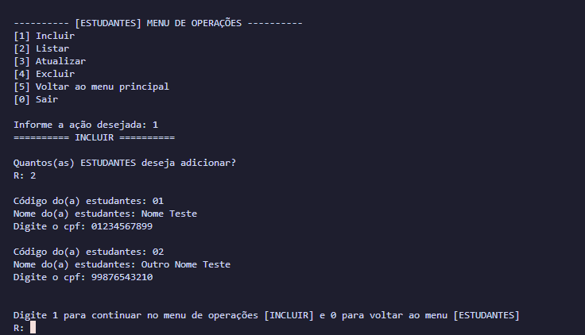
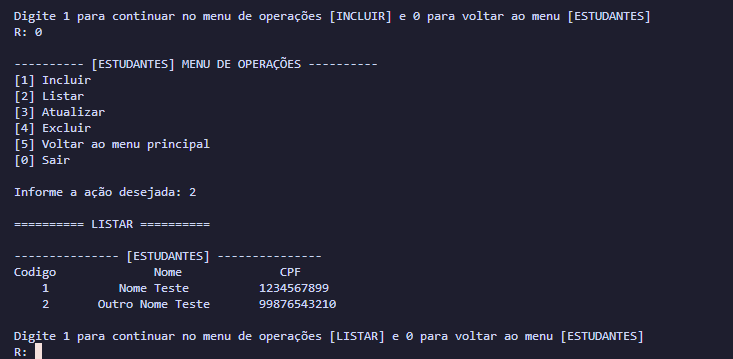

# CRUD - Gerenciamento Escolar

> status: concluído ✔️

_Leia isso em outro idioma:_
[_Inglês_](./../README.md)

## Sobre o Projeto

Esse é um projeto CRUD de gerenciamento escolar, que possui todas as funcionalidades de um crud e armazenas todos os dados em JSON, dentro do programa é possível criar, deletar, atualizar e ler os dados de: estudantes, professores, matrículas, turmas e disciplinas.

## Foto de Exemplo







## Tecnologias Usadas e Dependências

<table>
  <tr>
    <td>Python</td>
  </tr>
  <tr>
    <td>^3.x</td>
  </tr>
</table>

## Como Usar

- Clone esse repositório para o seu ambiente local:

```bash
git clone https://github.com/eriksgda/crud.git
```

- Execute o arquivo principal do programa:

```bash
python main.py
```

- Siga as instruções na linha de comando para navegar pelo sistema e realizar operações CRUD no sistema.

## Licença

Esse projeto está sob a licença [MIT](./../LICENSE).
